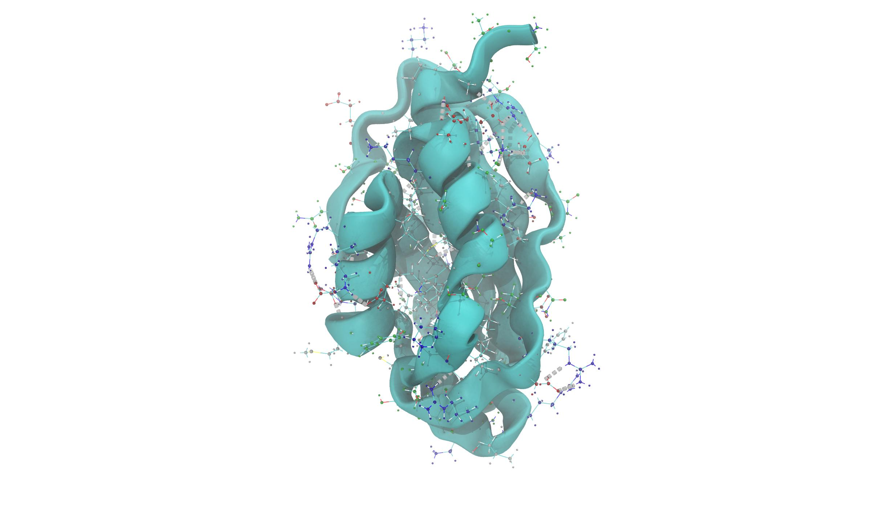
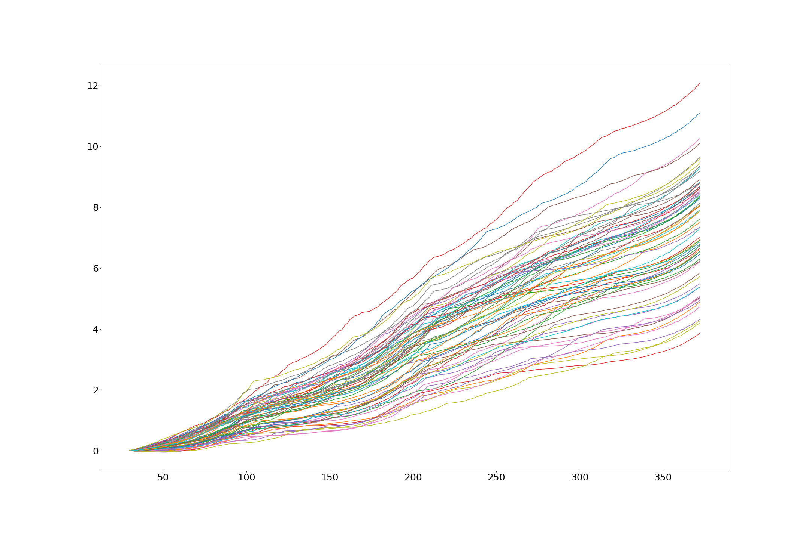

# Nonequilibrium Thermodynamic Integration by means of Steered Molecular Dynamics of _Equus caballus_ Acylophosphatase (1APS)

This repository contains scripts to calculate a free energy profile of [1APS](https://www.rcsb.org/structure/1APS "1APS pdb") between its native and denatured state, by applying Jarzynski's equality to a dataset of steered molecular dynamics simulations, starting from a PDB file of the coordinates of the native state.
The theory behind the project is described in more detail [here](https://it.overleaf.com/read/ygvjwnpbbrfk "Nonequilibrium Thermodynamic Integration by means of Steered Molecular Dynamics of Equus Caballus Acylophosphatase (1APS)").




# Directories
```bash
├── steeredMDsimulations
│   ├── 
│   ├── input_files/
│   │  ├── aps.pdb
│   │  ├── aps.
├── Jarzinsky equality calculation
│   ├── 
├── README.md
```
# Requirements:
  * [VMD](www.ks.uiuc.edu/Research/vmd), a molecular graphics program
  * [NAMD](www.ks.uiuc.edu/Research/namd), a molecular dynamics simulation program
  * Python 3
# 1. Run multiple SMD simulations

## 1.1 Protein equilibration

### 1.1.1 Input
### 1.1.2 Run protein equilibration using NAMD
```bash
```
### 1.1.3 Output

## 1.2 SMD for different starting point

See [namd tutorial guide on steered molecular dynamics simulations](https://www.ks.uiuc.edu/Training/Tutorials/namd/namd-tutorial-unix-html/node16.html) to know how to set up and run constant velocity pulling steered MD simulations. You should end up with somAll files are already created inside  /steeredMDsimulaitons/input_files/  The configuration file for NAMD is in /steeredMDsimulaitons/apf.conf
### 1.2.1 example_input
+protin.psf
### 1.2.2 run SMD simulation using NAMD

```bash
```
### 1.2.3 run multiple simulations

```bash
```

### 1.2.4 example_output?


# 2. Analyze data and calculate free energy:


# 3. Plot what you like

